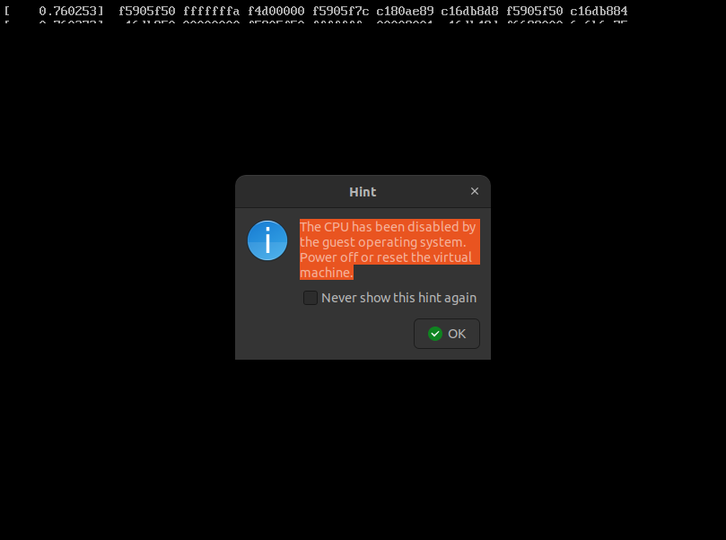

# I. Building the rootfs

    I. What you have made for the history to work. (no screen capture needed).

    II. Give the option you have removed and make a screen capture of the failed boot.

    III. Provide a screen capture proving that your system call works. Nothing else is required.

    IV. Give your code or screen shots of your code, and provide screen shots of your tests.

    Bonus work. give a link to your VM.


 ```bash
$ cd
$ echo 'export HISTFILE="/usr/src/history_file"' >> /usr/src/initrid/root/.profile
$ makeinitrd > /boot/core.gz
$ reboot
 ```

 II. Give the option you have removed and make a screen capture of the failed boot.

After run
```bash
$ make menuconfig
```
we have the following screen 

By searching with /ram, we can find that it is in the General setup


We disable Initial RAM filesystem and RAM disk (initramfs/initrd) support

save as removeRAMsupport.config and exit

After compiling new kernel, we have


second time compiling


Once compiled, the new kernel should be made available at startup choice menu. This menu is offered by the grub bootloader. Explain what a bootloader does and at which step of the boot process it is called

At startup, select your new kernel and check whether it works, or not. If it doesn't boot, check where it stops during the boot process, and explain why. Don't spend too much time on this exercise, the most interesting part of this laboratory course is still to come! When you have finished this first exercise, reboot on the default kernel i.e., on the one initially provided, and rerun make menuconfig: your objective is to select initially selected options (configuration you had when you first run make menuconfig). 

After reboot, we have


failed boot



add


finish compile new kernel with new syscall


after correcting and compiling, we have


create example.c file at /usr/src/test_syscall

